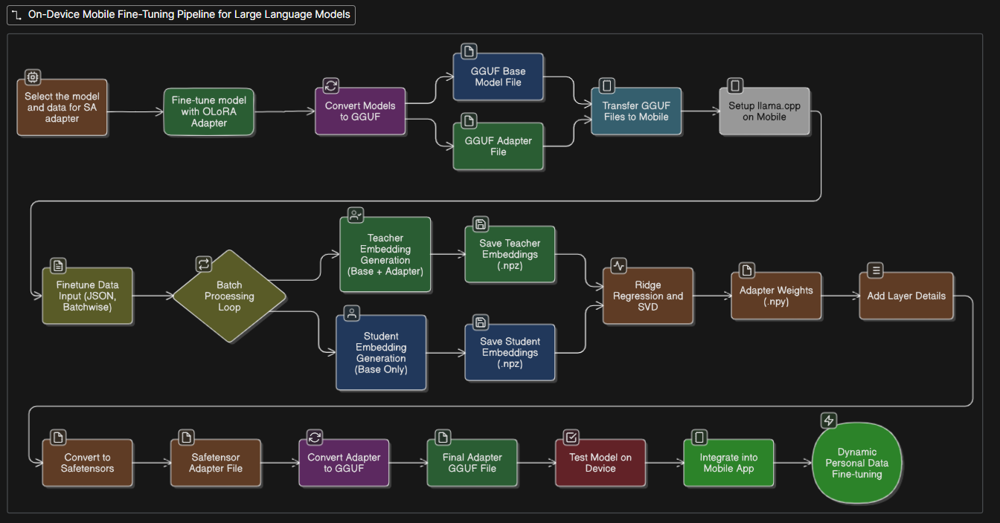

# Technical Architecture

## System Components
1. **Base Model + Adapter** (trained on laptop/desktop).
2. **Mobile Runtime** (Termux + llama.cpp).
3. **Embedding Pipeline** (student-teacher comparison).
4. **Regression + SVD Compression** (lightweight math ops).
5. **Conversion & Packaging** (→ gguf).
6. **Mobile App Interface** (UI for personalization).

## Architecture Diagram

## Dataflow
1. Input data (user-provided JSON).
2. Llama-embedding script → teacher/student embeddings.
3. Regression + SVD → new safetensor.
4. Convert LoRA to gguf → final model.
5. Mobile UI loads fine-tuned gguf for inference.

